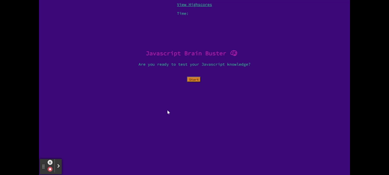

# code-quiz

## Description

This code quiz asks questions relating to JavaScript using HTML, CSS and JavaScript to run and style the application. Used within the JavaScript are a number of different functions and methods to create different elements on the page. These include Arrays, Objects, Functions, Methods, Local Storage and more. The CSS used variables for consistent styling and the HTML includes both classes and ID tags.

## Links
A link to the repo on Github can be found [here](https://github.com/Ryocon/code-quiz)

## Screenshots

